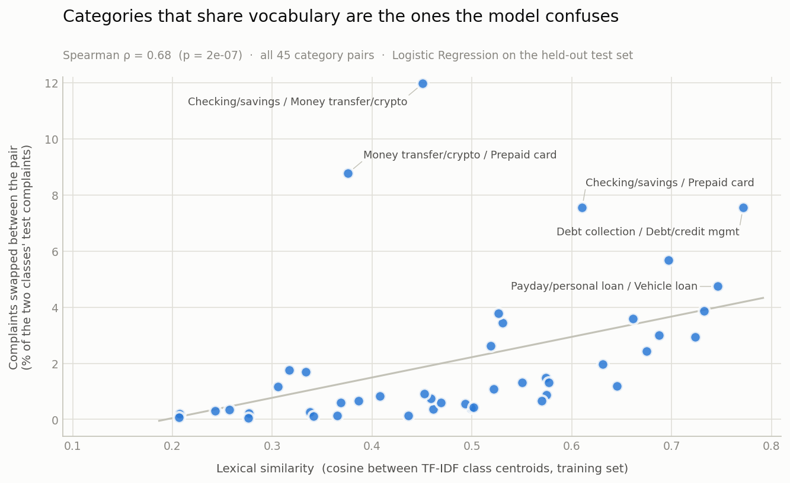

# Auto-sorting Financial Complaints
> How accurately can free-text complaints be automatically classified for routing? This project evaluates the predictive performance and practical trade-offs of different NLP approaches using real-world consumer complaints

## Goal

This project wants to build and evaluate an automated complaint-routing system that assigns customer complaints to the correct product category. The project compares a traditional TF-IDF + Logistic Regression model with DistilBERT to determine whether advanced NLP delivers enough improvement in classification accuracy to justify its complexity and computational cost.

Model performance will be evaluated both overall and by complaint   category to identify strengths, weaknesses, and limitations.

## Results

### DistilBERT wins every metric, but by margins 1.1-2.0 points, and it takes far longer time to train. Both models were scored on the identical 36,615-row test set.

| Metric | TF-IDF + Logistic Regression | DistilBERT |
| --- | --- | --- |
| Accuracy | 0.7898 | 0.8034 |
| Macro F1 | 0.7030 | 0.7225 |
| Weighted F1 | 0.8061 | 0.8173 |
| Training time | **11.6 s**, CPU | 1,434 s, GPU |

> **Macro F1** averages the ten per-category F1 scores equally.  
> **Weighted F1** averages the ten per-category F1 by category size.

### Both models are strongest and weakest on exactly the same categories

| Category | Test rows | LR | DistilBERT | Gain (F1 pts) |
| --- | --- | --- | --- | --- |
| Mortgage | 2,641 | 0.929 | 0.935 | +0.6 |
| Student loan | 1,459 | 0.918 | 0.923 | +0.5 |
| Debt collection | 10,706 | 0.871 | 0.876 | +0.5 |
| Vehicle loan or lease | 2,050 | 0.829 | 0.857 | +2.8 |
| Credit card | 6,861 | 0.815 | 0.827 | +1.2 |
| Checking or savings | 7,201 | 0.775 | 0.782 | +0.7 |
| Money transfer / crypto | 3,455 | 0.697 | 0.724 | +2.7 |
| Payday / personal loan | 1,430 | 0.617 | 0.629 | +1.2 |
| Prepaid card | 431 | 0.345 | 0.419 | +7.4 |
| Debt or credit management | 381 | 0.236 | 0.255 | +1.9 |

- Mortgage and Student loan are near-solved. Debt or credit management and Prepaid card are badly broken for both.

### The verdict

DistilBERT is ahead by 2.0 points of macro F1 and costs roughly 124 times the training time
plus a GPU. It also fails where Logistic Regression fails: Prepaid card finishes at 0.42 and
Debt or credit management at 0.26, so the queues route badly under both.

### Why those categories share a wall

To test whether shared vocabulary is what drives the errors, each category is represented by
the average TF-IDF vector of its training complaints, and all 45 category pairs are plotted
on two axes:

- **X-axis**- cosine similarity between the two category vectors, measuring how much vocabulary the pair shares (on training data).
- **Y-axis**- how often the two categories are actually swapped (on held-out test data).

Across all 45 category pairs, shared vocabulary predicts swap rate: **Spearman rho = 0.685,
p = 2.1e-07**. The worst pair, Checking or savings
against Money transfer, swaps 1,275 complaints, 12.0% of the two categories combined.

So the problem is the vocabulary, not the model. TF-IDF only counts words, so two categories
that use the same words look nearly identical to it. DistilBERT reads those words in context
and recovers part of the difference: its gains land almost entirely on the categories that
get confused with each other, but not by enough to make them usable.

## Key configuration

Both models were given the same data, the same split, and the same imbalance handling. Where
the two columns differ below, it is because the two methods need different things, not
because one was tuned harder than the other.

| | TF-IDF + Logistic Regression | DistilBERT |
| --- | --- | --- |
| Text cleaning | Redaction masks, case, punctuation and digits all stripped | Redaction masks only |
| Representation | 20,000 unigram + bigram features, English stopwords removed, fitted on train only | `distilbert-base-uncased`, 256 wordpieces |
| Imbalance handling | `class_weight='balanced'` | Class-weighted cross-entropy, same `N / (K · n_k)` formula |
| Training rows | 70,114 | 70,114 |
| Hyperparameter | C=1.0, L2, lbfgs | 3 epochs, lr 2e-5, batch 32, weight decay 0.01 |
| Checkpoint selection | Not applicable | Best macro F1 on the validation set |
| Hardware and time | CPU, 11.6 s | Tesla T4, 1,434 s |

## The data and the pipeline

The source is the CFPB Consumer Complaint Database, a ~9.1 GB CSV of ~17M rows, streamed
with DuckDB. Filtering to complaints received between
2025-01-01 and 2026-12-31, in ten product categories, with a non-empty narrative leaves
**407,321 rows**.

Rows are deduplicated before the split. Two complaints count as the same when their text is
identical after the cleaning the model's input receives. (22 narratives clean down to
nothing and are dropped.)

1. **Drop text whose label is ambiguous.** 210 texts appear under more than one category,
   covering 24,007 rows. The text does not say which label is right, so all of them go.

2. **Collapse the copies.** One text appears 7,111 times. The 383,292 remaining rows fold down to **334,658 distinct complaints**.

The split is then time-ordered, training on the past and evaluating on months never seen:

    train  ≤ 2025-12  (capped to 70,114)
    val     2026-01/02  (29,705)
    test    2026-03/04  (36,615)

Three rules hold throughout: no text straddles a split even after cleaning; evaluation sets
are never rebalanced, so the test set runs at its real 28:1 imbalance; and the test set is
read exactly once, with all model selection done on validation. One cost is worth naming:
because deduplication runs before the date cut, templates filed in both windows may survive
only in training, leaving the test set skewed toward genuinely novel text.

## Limitations

**The labels were chosen by consumers, not by specialists.** Some categories are very difficult for consumers to distinguish. For example, “Debt collection” and “Debt or credit management” are very similar, with a cosine similarity of 0.772. These two categories are also among the hardest categories for both models to classify correctly.

This suggests that some of the errors may come from incorrect or inconsistent labels in the dataset. If the complaints were labeled by specialists, both models would likely perform better. The performance ceiling is partly limited by the quality of the dataset itself.

**Compute budget, truncation.** Training rows were capped at 8,000 per class
as a GPU budget, imbalance is handled by class weighting, not by the cap. DistilBERT
truncates at 256 wordpieces while TF-IDF reads every document in full, so the two models do
not see the same amount of each long complaint.

## Files and how to run

| File | Role |
| --- | --- |
| `data_cleaning.ipynb` | Filters the raw CFPB CSV with DuckDB, writes `cfpb_filtered.parquet` |
| `ml_model_lr.ipynb` | Owns the split. writes `train/val/test.parquet` and trains and evaluates Logistic Regression |
| `dl_model_distilbert.ipynb` | Fine-tunes DistilBERT on those same three parquets; needs a GPU |
| `requirements.txt` | Dependencies for the two local notebooks |
